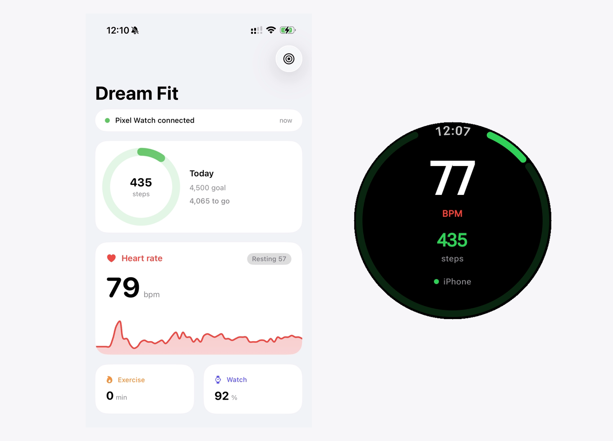
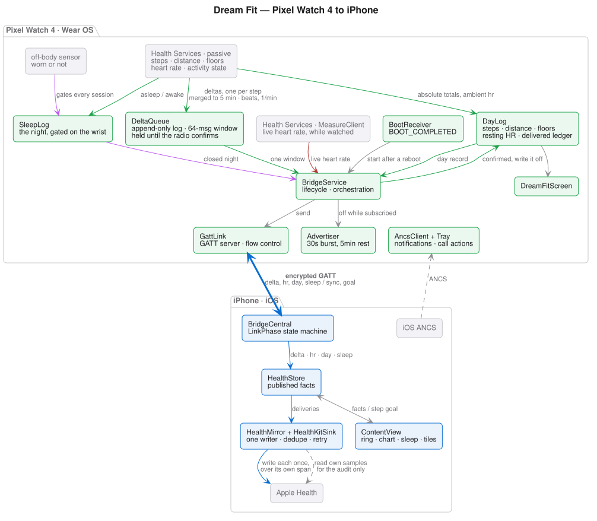

# Dream Fit — use a Pixel Watch with an iPhone

A Wear OS to iOS bridge for the Pixel Watch 4: use your watch from an iPhone. iOS exposes no BT Classic RFCOMM to
non-MFi accessories and no Google Mobile Services, so a true pairing clone is
impossible — this is a practical **side-channel bridge** over Bluetooth LE
instead: the watch advertises a tiny GATT service, the iPhone app acts as
central, and daily health data flows as absolute, idempotent messages.





## How it works

- **Transport:** Nordic-UART-shaped GATT service `6E400001-…` — RX (`…0002`,
  phone → watch) and TX (`…0003`, watch → phone), newline-delimited UTF-8
  JSON, flow-controlled in both directions, and gated on an encrypted,
  MITM-protected link. Full contract: `docs/01-protocol.md`
  (canonical definition: `wear/…/BridgeGatt.kt`).
- **Data model:** the **watch owns every daily aggregate**, and one lane writes
  to Apple Health. `delta` messages carry the span each interval of steps,
  distance or floors happened in — Health Services publishes one per step, so
  they are the measurement rather than a hint about it — and timestamped `hr`
  messages carry one median reading per minute. Both ride a durable queue that
  survives a day with nobody listening. `day` messages are absolute (`steps`,
  distance, floors, resting HR, battery, the watch's own local date, what the
  belt has delivered, and the bridge's incarnation), sent on subscribe, on
  change (debounced) and on a 15-minute heartbeat. They drive the screens and
  the audit; they never write to HealthKit. Having both lanes write is what
  made the same steps land twice.
- **Phone → watch:** app notifications (`notify`), the user's daily step goal
  (`goal`, which drives the watch bezel as well as the phone ring) and an
  explicit re-sync request (`sync`). Separately, a complete `AncsClient` puts
  every iPhone notification on the wrist over ANCS — per-app identity, grouped
  summaries, and answer/decline for incoming calls — riding the same bond the
  GATT service requires.
- **Power:** the app holds no sensor to watch a number the platform already
  measures. Ambient steps and heart rate come from Health Services passive
  monitoring; the PPG is powered via `MeasureClient` only while the phone is
  subscribed or the screen is up, on a 120 s deadline. The radio adds ≈0.06 mA
  (`LOW_POWER` advertising, 30 s burst / 5 min rest, off while subscribed).
  The regression this replaced held the PPG continuously and imposed a ~7.8 mA
  floor the watch could never drop below; with it gone, no sensor duration is
  attributed to the app at all. See `docs/03-power.md`.
- **UI:** SwiftUI on iPhone — settable step-goal ring, live HR chart, last
  night's sleep, distance/floors/exercise/battery tiles, permission banners.
  Compose for Wear OS on the watch — step goal on the bezel, HR, steps,
  distance · exercise · floors, last night, link state, and a tappable warning
  when Health Services drops the passive registration.

## Layout

```
ios/     iPhone app (SwiftUI) — BridgeCentral (BLE link state machine), WatchEvent
         (wire shapes + day boundaries), HealthKitSink (async HealthKit),
         HealthMirror (queue, diff and retry against Apple Health), HealthStore
         (model + published facts), ContentView/Components, Diagnostics,
         xcodegen project.yml
wear/    Wear OS app (Kotlin) — BridgeService (lifecycle + orchestration),
         GattLink (GATT server, reassembly, flow-controlled notify), DeltaQueue
         (movement spans held until the link confirms delivery), DayLog
         (the day's aggregates and their rules), SleepLog (the night's rules),
         WristWatcher (worn or not), Advertiser (radio duty cycle), Settings
         (step goal), Tray (notifications), BridgeGatt (wire contract),
         DreamFitScreen, AncsClient, PassiveDataService
brand/   One heart-with-pulse mark (generate-icons.py) → all platform assets
docs/    00 watch setup · 01 protocol · 02 baseline · 03 power · 04 parity
         status · 05 troubleshooting · 06 lifecycles · 07 what Health Services
         actually delivers · PlantUML sources (architecture, sequence, shared
         style)
capture/ Redacted reference dumps from the original bring-up
```

## Getting started

Prereqs: Xcode 16+, `xcodegen`, Android Studio + platform-tools, a Pixel Watch
with developer options (see `docs/00-watch-setup.md`).

**iPhone app:**
```
cd ios
cp Signing.xcconfig.example Signing.xcconfig   # then add your team ID
xcodegen generate                              # the .xcodeproj is not tracked
open DreamFit.xcodeproj
```
Build to device — Bluetooth and HealthKit entitlements both require real
hardware.

**nRF Connect** will find `6E400001` in an advertising burst but will be refused
when it tries to read: the characteristics require an encrypted, MITM-protected
link, so only the bonded phone gets in. That refusal is the check passing.

**Wear app:** needs JDK 17+ (Android Studio's bundled JBR works:
`export JAVA_HOME="/Applications/Android Studio.app/Contents/jbr/Contents/Home"`).

Wireless debugging on the watch hands out a one-shot pairing port and a
separate connect port — Settings → Developer options → Wireless debugging:
```
adb pair <watch-ip>:<pairing-port> <code>
adb connect <watch-ip>:<connect-port>
cd wear && ./gradlew :app:installDebug   # or installRelease
```
The foreground service starts advertising in low-power bursts; the iPhone app
pages the known peripheral directly once seen, so later reconnects need no
advertising.

**Pair the watch to the iPhone** — Settings → Bluetooth on the phone, and accept
on the watch. This is not optional: the GATT characteristics require an
encrypted, MITM-protected link, so without the bond the bridge never connects.
It is also what brings ANCS to life, so iPhone notifications land on the wrist
from the same step.

## Status

Working: encrypted BLE link (an explicit state machine with deadlines on the
iPhone, scheduled re-burst on the watch), foreground-persistent watch service,
iPhone notifications on the wrist over ANCS with answer/decline for calls,
in-app notify → watch notification, timestamped heart rate and movement written
to Apple Health from one queue (kept and retried when the phone is locked,
denied or relaunched in the background, and restarted with the watch after a
reboot), a step goal you set on the phone that drives both screens, light/dark
iPhone UI. Next: media control (AMS client); Google
sign-in for Calendar/Gmail/Weather. Honest ledger, including what is
impossible (eSIM, Wallet, Play installs, Fitbit-cloud sync): `docs/04-parity.md`.
If a number looks wrong, `docs/05-troubleshooting.md` names the three different
step counts and how to tell which one is lying.

## Privacy

Your health data never leaves your devices: watch → your iPhone over BLE →
Apple Health on that same iPhone. No accounts, no cloud sync, no analytics.
What this app writes to HealthKit is scoped to its own samples, so it neither
reads your iPhone's pocket pedometer nor touches other apps' data, and the
watch keeps only the current day's aggregates and its undelivered queue in
local storage.

The link is encrypted. Every characteristic requires an encrypted,
MITM-protected connection, so the watch refuses to be read, written or
subscribed to until the link is secured with the keys from the phone's own
pairing — the same bond ANCS uses. Nothing in radio range can connect and read
your heart rate or step count, and nothing crosses the air in the clear. The
trade is that the bridge needs that pairing: unpair the watch and the service
goes dark rather than degrading to plaintext. Details and the verification:
`docs/01-protocol.md`.

This is transport security for a personal bridge, not a claim of
medical-device certification.

Repo hygiene, separately: `capture/` dumps and `docs/` are scrubbed of MACs,
serials, node IDs and LAN addresses (see `capture/README.md`). No Apple signing
team is checked in: it lives in the gitignored `ios/Signing.xcconfig`, and the
generated `.xcodeproj` is untracked precisely because Xcode writes the team into
it the moment you touch signing.
