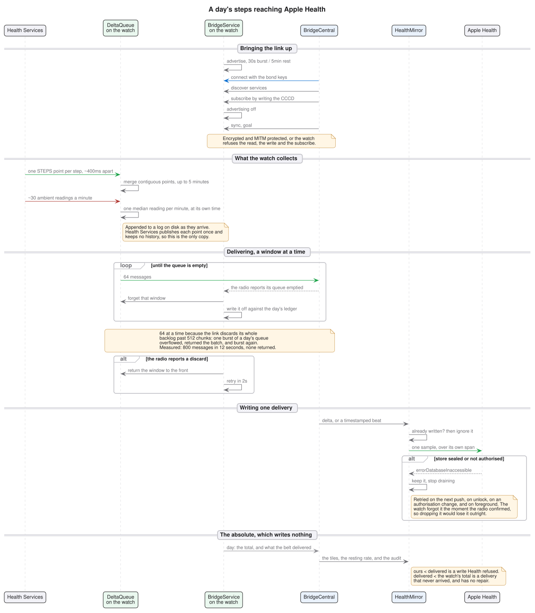

# 06 — Lifecycles



Four state machines, two per end. They are written as machines because every
link bug this project has had was the same shape: two variables disagreeing
about one fact, with no name for the state they disagreed about.

## iPhone — the link (`BridgeCentral`)

One `phase`, one function that changes it, one timer that decides when a phase
has lasted too long to be believed.

| Phase | Means | On entry | Deadline |
|---|---|---|---|
| `radioDown(s)` | Bluetooth off, unauthorised or resetting | drop handles and buffers | — |
| `searching` | nobody to talk to yet | page the known watch, then scan | — |
| `connecting` | a connect request is outstanding | — | 120s → `searching` |
| `resolving` | connected; asking which characteristics exist | discover services | 10s → retry, 3× → drop link |
| `receiving` | the watch is talking to us and we hold no handle to answer on | — | 60s → rediscover, 3× → drop link |
| `ready` | full duplex | announce, then `sync` | — (freshness rules below) |

`searching` and `ready` are steady states. Everything else is a transition, and
a transition that does not finish **is** the bug — which is why only those
carry deadlines.

`receiving` is the important one. iOS can restore a subscription whose
characteristic discovery never completed, so notifications arrive on a handle
the app never learned about: the watch is heard and cannot be answered, `sync`
and `goal` go nowhere, and nothing renegotiates. It used to take a force-quit.
Naming the state is what let a timer fix it.

### Freshness

Liveness is counted in `day` messages, not in bytes — heart rate arrives every
5 s and would mask a link that can receive but no longer send.

- 20 minutes without a `day` (the heartbeat is 15) → send `sync`
- 25 minutes → drop the connection

Dropping is the point: reconnecting forces a fresh discovery and a fresh CCCD
write, which is the part the watch is waiting for.

## Watch — coming back

`START_STICKY` restarts a service whose *process* died. It does nothing across
a device reboot, so before `BootReceiver` existed a restarted watch collected
nothing until somebody opened the app — one reboot cost about 1,280 steps that
no later message could recover. The receiver starts `BridgeService` on
`BOOT_COMPLETED`, which the platform allows as a foreground start under its own
exemption:

```
adb shell dumpsys activity services com.drmhse.dream.fit
  intent={act=dreamfit.BOOT ...}
  infoAllowStartForeground=[... code:BOOT_COMPLETED ... BFGS denied: false]
  isForeground=true
```

That is the check worth running after a reboot, because the boot log itself
rotates out of logcat within minutes on this watch.

## iPhone — the Health writer (`HealthMirror`)

| State | Means |
|---|---|
| idle | nothing outstanding |
| unwritten | deliveries HealthKit has not accepted yet, in arrival order |
| draining | writing them out, one at a time |

Each delivered delta and beat is written once, over its own span, and a
delivery HealthKit refuses is kept and retried on the next push, on device
unlock, on an authorisation change, and on foreground. Keeping it is not
optional: the watch forgets a delivery the moment the radio confirms it, so
dropping one loses it outright.

Draining is serial and stops at the first failure rather than skipping past it,
because the usual failure is a sealed store and the next write would fail the
same way. A type the user has denied is the exception — its deliveries are
discarded rather than held, or they would stall every other type behind them.

There is no read-diff-write pass any more, and no settle window. The daily
absolute does not write. Sleep is queued by the same rule and for
the same reason: what the watch said and what Apple Health holds are tracked
separately, or a night dropped while the phone was locked would look like a
record we already had and never be retried.

## Watch — the link (`BridgeService` + `Advertiser`)

| Phase | Means | Leaves on |
|---|---|---|
| `STARTING` | service up, GATT server not yet answering | first burst, or a subscribe |
| `ADVERTISING` | burst window open, nobody subscribed | 30 s burst end → `RESTING`; subscribe → `SUBSCRIBED` |
| `RESTING` | between bursts, nobody subscribed | 5 min → `ADVERTISING`; subscribe → `SUBSCRIBED` |
| `SUBSCRIBED` | the phone is listening; advertising is off | unsubscribe or disconnect → `RESTING` |
| `STOPPED` | service destroyed | — |

`RESTING` earns its name: a watch saving battery between bursts is not a watch
that has lost the phone, and the two used to look identical on screen. The
phase comes from the radio's own callbacks, so it is observed rather than
assumed — a distinction that matters, because the stack reports advertising
asynchronously and a flag set from the request rather than the verdict is
wrong for as long as the stack takes to answer.

## Watch — the day record (`DayLog`)

Not a phase machine but a set of rules with one owner:

- rollover resets the day at the watch's own local midnight
- the Health Services aggregate is the authority and may only raise the total
- heart-rate samples carry their own time, so a batch of history and a live
  reading can interleave; the resting-rate window is anchored to the newest
  time seen, and needs twelve samples inside it before it will name a resting
  rate at all
- writes to storage are throttled, and forced before every push and on destroy

## Watch — the delta queue (`DeltaQueue`)

Two states and one rule, because a movement delta is the only message here that
no later absolute can reconstruct.

| State | Means |
|---|---|
| pending | on storage, waiting for a link with a subscriber |
| in flight | handed to the radio, not yet reported as sent |

In flight becomes forgotten when the radio reports its queue emptied cleanly,
and pending again on a discard, on the last subscriber leaving, or on a restart
that found a batch outstanding. Handing a message to the link is not delivering
it: the link discards its backlog on a disconnect, on a failed notify and on
overflow.

## Watch — the night (`SleepLog`)

Also rules rather than phases, and every one of them exists to avoid inventing
a night that did not happen:

- a session may only open on a worn watch, and its start is clamped to the
  moment the wrist began — a state delivered on registration can predate that
- taking the watch off closes the session at the moment of removal
- under 15 minutes is stillness; over 16 hours is a wake transition never seen
- only a closed session is sent, and the last one is re-sent on every subscribe
  and sync so a reconnect recovers it

## Redrawing the diagrams

`architecture.puml` and `sequence.puml` share `style.puml`. Graphviz does the
layout; PlantUML's built in smetana fallback routes edges badly enough that the
architecture diagram came out as a tangle:

```
java -jar plantuml.jar -tsvg -o . docs/architecture.puml docs/sequence.puml
```

SVG rather than PNG on purpose: it is text, so a diff shows what changed in a
diagram rather than that a binary blob moved.
